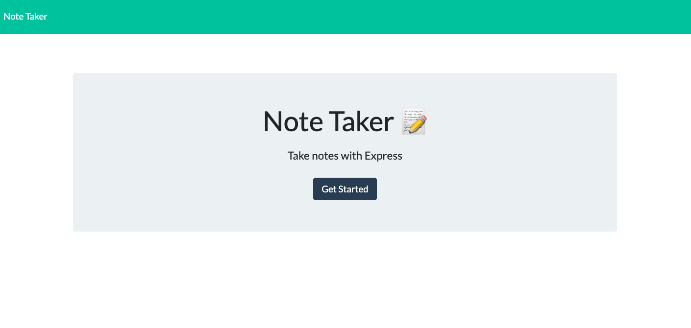
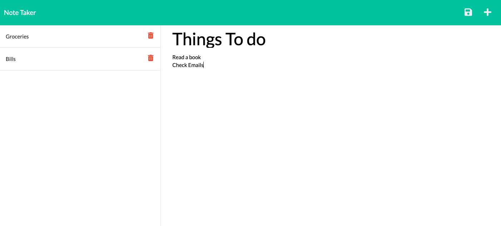

# note-taker
# Team Profile Generator
[](https://github.com/Naereen/StrapDown.js/blob/master/LICENSE)




## Project Description
Note-Taker is an application that can be used to write and save notes. This app uses Express.js back end and will save and retrieve note data from a JSON file. 


## Installation
1. Clone Repository
2. Run the following line of code in terminal to install packages:
`npm i`

## User Story
```
AS A small business owner
I WANT to be able to write and save notes
SO THAT I can organize my thoughts and keep track of tasks I need to complete

```

## Important Links

- [GitHub Repository](https://github.com/maiaferrer/team-profile-generator)
- [Heroku Deployment](https://maiaferrer-note-taker.herokuapp.com/)


## Technology used


## Contact Me

For further quesitons contact me at: maiaferrer604@gmail.com or
[Github](https://github.com/maiaferrer) or
[Linkedin](https://www.linkedin.com/in/maia-f-2b7aa710a)

## Credits

Frontend starting files were provided by © 2023 Trilogy Education Services, LLC, a 2U Inc brand. Confidential and Propriety. All Rights Preserved. 
